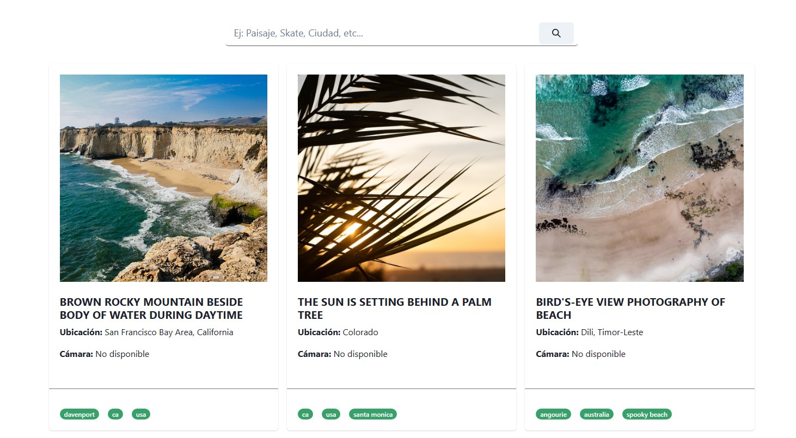

<!-- Mensaje de bienvenida -->
<h2>¡Bienvenido a mi página para buscar imágenes de Unsplash!</h2>

<h3>En qué consite el trabajo</h3>

<!-- Sobre el proyecto -->

El proyecto consiste en mostrar una galería de imágenes random cuando el usuario visita por primera vez la página y que, luego, pueda realizar búsquedas por palabra clave.

<!-- Puntos importantes -->
<h3>El proyecto tuvo los siguientes desafíos:</h3>

- Todo el proyecto se realizó en React-Vite.

- Se utilizaron un context y un hook para que la información quede disponible en los componentes.

- En el context se extrajo la API del random con un useEffect y se generó una función para la búsqueda. 

- El hook sirvió para tomar la info del context y exportarla a los componentes. Así, en lugar de llevar los datos del provider directamente a los componentes, los llevamos con el hook y ahorramos líneas de código en estos, dejando el código de los componentes mucho más limpio y legible.

- Para el trabajo se utilizó el framework de Bootstrap, aunque solo para el Container, el resto de las etiquetas son del framework Chakra.

- También, se utilizó el paquete de axios para las API, ahorrando un poco de código, en lugar de utilizar fetch.

- Para el Lazy Load se utilizó React Lazy Load.

- También, se hizo accesible, a través del teclado, el Input.

- La aplicación es responsive.

- Uno de los puntos que más costaron fue el de mostrar las cámaras en los resultados de búsqueda, ya que la API disponible para hacer las búsquedas no tiene esta extensión. Para resolver esta situación, se hizo una llamada a la API que si tiene esta extensión, dentro de la Card y se le pasó el id de cada imagen que llegaba a la Card. Una vez tenido esto, se pasó el resultado de la cámara a la Card. Todo dentro del mismo componente.

- Por último, el proyecto se encuentra deployado en Github y se puede acceder a través del siguiente link: **[Buscador de Imágenes](https://agusmachado.github.io/buscadorimagenesdos/)**